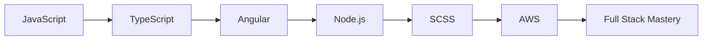

# Hi there! 👋 I'm Jakob Neri

  

## 🚀 About Me

I'm a passionate developer constantly exploring new technologies and building amazing things! Currently diving deep into modern web development and cloud technologies.

- 🔭 I'm currently working on exciting web applications
- 🌱 I'm currently learning **Angular**, **Node.js**, **SCSS**, and **AWS**
- 🏆 **AWS Certified Cloud Practitioner** - [View Credential](https://www.credly.com/users/jakob-neri/badges#credly)
- 💡 I love solving complex problems and creating efficient solutions
- 🎯 Goal: To become a proficient full-stack developer
- ⚡ Fun fact: I believe code is poetry in motion!

## 🛠️ Tech Stack

### Frontend

### Backend

### Cloud & DevOps

### Databases

## 📊 GitHub Stats

  
  

  

## 📈 Activity Graph

  

## 🎯 Current Learning Path

## 🌟 Featured Projects

<!-- You can add your projects here when you have them -->

  <i>🚧 Exciting projects coming soon! 🚧</i>

## 📫 Let's Connect!

  

  
  
  **Thanks for visiting my profile! Have a great day! 😊**

<!---
jakobneri/jakobneri is a ✨ special ✨ repository because its `README.md` (this file) appears on your GitHub profile.
You can click the Preview link to take a look at your changes.
--->
